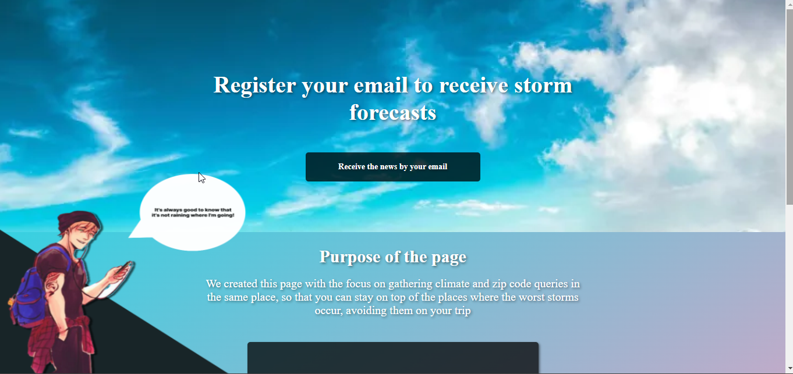

# Avoiding_Storms Project

## Introduction

Welcome to the Avoiding_Storms project! This project was developed with the idea of helping users check the weather conditions of various locations by searching for the city name, allowing them to avoid localized storms. Additionally, users can search for cities based on their postal codes. Whether you're on your smartphone or computer, you can easily access this project using the provided link.

Please note that for optimal performance on mobile devices, character animation effects have been disabled.

## About the Project

Before diving into the development, I created a navigable prototype to visualize the final product. With over two years of experience in UX and UI Design, I've worked with various companies in Curitiba and beyond, utilizing these skills to enhance the project's user experience.

## Challenges Faced

One of the main challenges during this project was my recent introduction to TypeScript, which I had started learning just a week before. Adjusting to the way props are treated and imported presented a learning curve, but with dedicated research, I was able to overcome these obstacles.

## Features

This project incorporates Axios to efficiently import data from APIs, providing versatility and up-to-date information. The use of styled-components streamlines the process of maintaining and organizing distinct styles for each component.

## Future Outlook

In five years, I envision myself as a senior software engineer, having established my own company and launched products like Sass and related technologies. Furthermore, I anticipate an expanded online presence on platforms like Instagram, where you can follow my professional journey.

## Get in Touch

If you're interested in following my progress and staying connected, feel free to follow me on my [Instagram](link-to-instagram). Your support and engagement are greatly appreciated!

Thank you for exploring the Avoiding_Storms project. Your interest and feedback are invaluable as I continue to refine and enhance this initiative.
